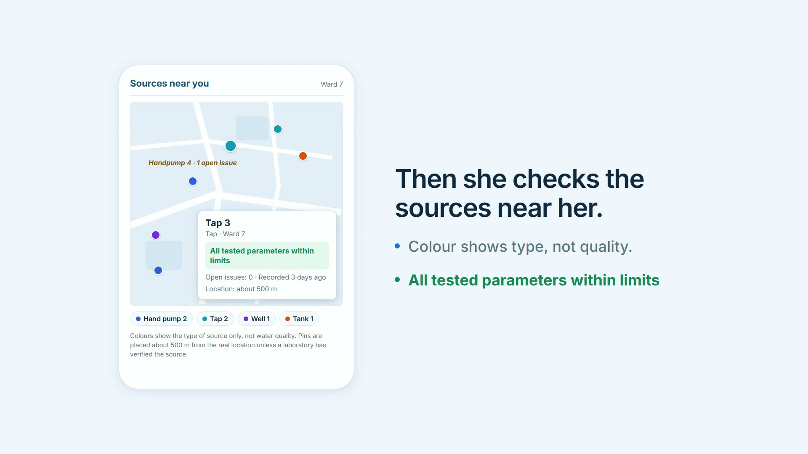
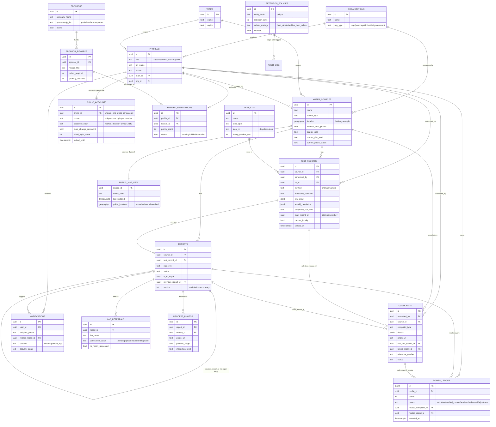

# JalSakshi — Community Water-Quality Monitoring

JalSakshi ("water witness") connects **field workers, supervisors, labs and
residents** around one accountable loop: test a water source → raise a report
with a risk level → send it to a lab → re-test until it is safe → close it with
evidence → tell the public. Residents see a public map, file complaints with
photos, and earn points for real issues.

## 🎬 Demo video

[](brag-output/brag.mp4)

**Video file:** [`brag-output/brag.mp4`](brag-output/brag.mp4) (thumbnail:
[`brag-output/brag.jpg`](brag-output/brag.jpg); HyperFrames source in
[`brag-output/composition/`](brag-output/composition/)).

## What's in the box

| Part | Path | What it does |
|------|------|--------------|
| Mobile app | [`apps/mobile/`](apps/mobile/) | One Expo app with three modes: **field worker** (strip test via camera or manual entry, works offline and syncs later), **resident** (sign-in, complaints with photos, Pluccy screening, points), and a **public map** |
| Supervisor dashboard | [`apps/supervisor/`](apps/supervisor/) | Web board for the case queue, lab referrals and re-reports, evidence photos, closures, leaderboards, CSV export |
| API | [`services/api/`](services/api/) | FastAPI backend: auth, team-scoped staff routes, public/resident routes, authority escalation e-mails, offline fallback store |
| Database | [`services/api/sql/public_v2/`](services/api/sql/public_v2/) | Supabase/PostgreSQL schema, row-level security, points triggers, retention policies |
| ML | [`ml/`](ml/) | Test-strip colour model (training, calibration, ONNX export), run on the phone through onnxruntime |
| Contracts | [`contracts/`](contracts/) | OpenAPI spec and generated TypeScript client |
| Docs | [`docs/`](docs/) | Security review, data protocol, pilot protocol, release evidence |

## Tech stack

- **Mobile:** React Native 0.86 · Expo 57 · TypeScript · onnxruntime-react-native (on-device strip reading) · custom native capture module ([`modules/capture-native`](modules/capture-native))
- **Supervisor web:** React 19 · Vite · TypeScript · Leaflet · lucide-react · Node server (`server/index.ts`) · Vercel config
- **Backend:** Python 3 · FastAPI · Pydantic v2 · Uvicorn · psycopg 3 · python-jose (JWT/JWKS) · Pillow (upload validation)
- **Database & auth:** Supabase (PostgreSQL + Supabase Auth), RLS, `pgcrypto`, `pg_cron`; SQLite fallback store when Supabase is unreachable
- **ML:** Python, trained colour/strip model exported to ONNX
- **Infra & tooling:** Docker, Render (`render.yaml`), EAS builds (`eas.json`), ngrok tunnel for phones, Playwright, Node test runner, Python unittest suites, GitHub Actions CI
- **Demo video:** HyperFrames

## How to run

### Prerequisites

Python 3.11, Node 24, npm, a Supabase project (or run offline on the
built-in fallback store), and optionally ngrok plus Expo Go or an Android device.

### 1. Configure

```sh
cp .env.example .env                      # fill in the Supabase URL, DB URL and publishable key
cp apps/supervisor/.env.example apps/supervisor/.env
```

Never put the Supabase `service_role` key in any `.env` used by the apps.

### 2. Database (first time only)

```sh
pip install -r services/api/requirements.txt
# apply each schema file in services/api/sql/public_v2/ in numeric order (001 → 011), one file per run
for f in services/api/sql/public_v2/[0-9]*.sql; do python tools/apply_public_v2.py "$(basename "$f")"; done
python tools/apply_public_v2.py seed_v2_demo.sql   # demo teams and accounts
python tools/seed_bulk_demo.py            # optional: 12 weeks of synthetic demo activity (idempotent)
```

### 3. API (port 8000)

```sh
python -m uvicorn services.api.app.main:app --host 0.0.0.0 --port 8000
```

To reach it from phones, `bash tools/dev_tunnel.sh` starts the API **and** an
ngrok tunnel, then writes the public URL into `apps/mobile/.env`.

### 4. Supervisor dashboard (port 5175)

```sh
cd apps/supervisor
npm install
npm run dev -- --host 127.0.0.1 --port 5175
```

Open http://127.0.0.1:5175. Demo supervisor login: `2@demo.org` / `1234`.

### 5. Mobile app

```sh
cd apps/mobile
npm install
npx expo start            # scan the QR code with Expo Go, or press "a" for Android
```

For an Android build, use `tools/build-android.bat` or `eas build -p android`.

### Tests

```sh
python -m unittest discover -s tests -p "*_test.py"   # API, workflow, security/tenant suites
python -m unittest discover -s ml/tests               # ML pipeline
npm ci && for f in tests/*.test.ts; do node "$f"; done  # Node suites (Node 24)
npx tsc --noEmit                                      # type-check tests and contracts
cd apps/supervisor && npm test                        # supervisor server tests
```

## Database ER diagram

This diagram follows the architecture sketch: Supervisor → Worker/Public →
Reports (risk levels) → Labs → re-report loop. It also covers photos and
inspection stages, phone notifications, and the public map → complaint flow.



### How the flow maps onto the diagram

1. **Water test capture** (worker or public): `test_records`. `method` is
   `manual` or `camera`; `dropdown_selection` and `autofill_calculation` capture
   the icon-driven strip read; `local_record_id`, `cached_locally` and
   `synced_at` implement "save locally → push online".
2. **Reports with risk levels:** every `test_record` that warrants attention
   produces exactly one `report`, which carries its `risk_level`.
3. **Labs → re-report loop:** a `report` goes to `lab_referrals`. If the lab
   requests a fresh sample (`re_report_requested = true`), a *new* `report` is
   created with `previous_report_id` pointing back. The loop is a
   self-referencing chain, so the original report is never changed.
4. **Photos and inspection levels:** `process_photos` is tagged by
   `process_stage` (initial capture, lab referral, corrective action, retest,
   closure) and `inspection_level` (field/supervisor/lab).
5. **Message on phone:** `notifications`, linked back to the report that
   triggered it.
6. **Public map and complaints:** `public_map_view` is the only thing the
   public reads directly, and locations are fuzzed unless lab-verified. A
   `complaint` can reference a `water_source`, carry a `photo_url`, and
   optionally link its own `test_records` row from a self-service strip test.
7. **Organizations:** NGO, panchayat and industrial bodies are
   `organizations`, linked to both `profiles` (staff) and `water_sources`
   (ownership and reporting responsibility).
8. **Automatic latitude/longitude:** locations come from device GPS by default,
   and the recorded accuracy is stored. The database refuses a manual pin
   override unless it names who approved it and why.
9. **Data retention:** `retention_policies` defines per-table retention.
   `purge_old_data()` runs nightly through `pg_cron` and logs each run to
   `audit_log`. `reports`, `lab_referrals` and `complaints` have no default
   purge because they form the accountability chain.
10. **Points:** `points_ledger` is append-only, and `profiles.points_balance`
    is kept up to date by triggers. A resident gets **+10** when a complaint is
    submitted, **+100** when a supervisor verifies it (status becomes
    `escalated`), and **+50** when the linked report is `closed`.
11. **Sponsors:** `sponsors` → `sponsor_rewards` → `reward_redemptions`, so
    several companies can fund separate reward pools.
12. **Leaderboards:** `leaderboard_public`, `leaderboard_field_worker` and
    `leaderboard_location` are plain SQL views, so they are always current.
    Field workers are ranked by tests performed + 5 × resolved cases.
13. **Public login:** there is one account per phone number. Passwords are
    hashed with `pgcrypto`, the default password `1234` must be changed at
    first login, and an account locks after 5 failed attempts.
    `verify_public_login()` is the only way to check a password.
    ⚠️ The shared default password is for the pilot/demo only.

## Security notes

- Secrets live only in gitignored `.env` files. [`.env.example`](.env.example) holds placeholders.
- Row-level security and team scoping are enforced in the database and tested in [`tests/security/`](tests/security/).
- Uploaded images are decoded and validated server-side before they are stored.
- Demo data is **synthetic**. The API refuses to run in production unless `JALSAKSHI_TENANT_DATA_MODE=operational`.
