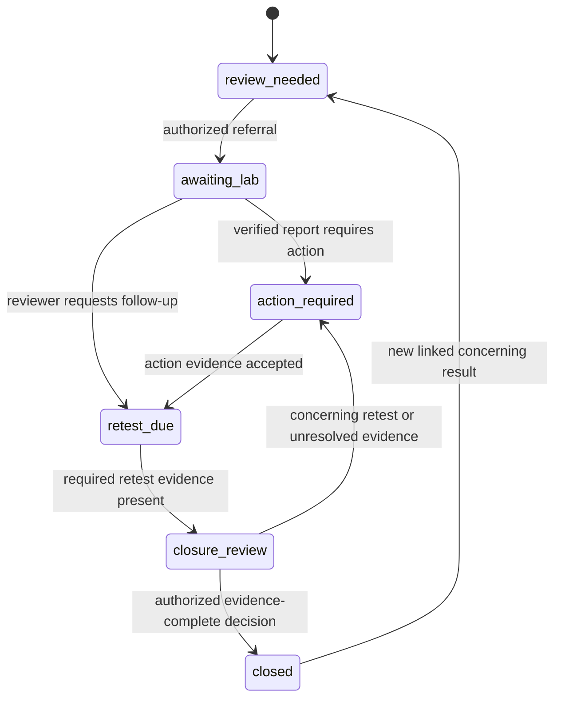

# Data model and invariants

PostgreSQL is server authority; SQLite contains the assigned working set, local drafts and outbox. IDs are client-generatable UUIDs. Times are UTC ISO-8601 on the wire; server arrival time and device-observed time are distinct. Every tenant-owned foreign key includes `tenant_id`; never join only on an untrusted UUID.

## Tables / records

| Entity | Key fields | Constraints and indexes |
|---|---|---|
| tenants | id, name, policy_version, active_languages | No public enumeration |
| users | id, subject, issuer, display_name, created_at, disabled_at | `subject`+`issuer` unique; `id` is ours, never the raw OIDC subject in foreign keys; no email/phone stored in v1 |
| memberships | tenant_id, user_id, role, active | Unique pair; roles worker, supervisor, lab_reviewer, admin. See [authorization matrix](authorization-matrix.md) |
| sources | tenant_id, id, qr_code, label, locality, optional coordinates/accuracy, active, version | Unique `(tenant_id, qr_code)`; index tenant/label and tenant/id |
| protocols | tenant_id, id, version, manufacturer, kit, parameter, unit, bins, read_window, quality_policy, reference_card, validity, approved_by | Immutable versions; shape in [protocol schema](protocol-schema.md); approved threshold provenance required; no guessed regulatory limits |
| kit_lots | tenant_id, id, protocol_id/version, lot, expiry, verification_status | Expiry and protocol consistency; lot is not model validation by itself |
| model_manifests | id, version, sha256, feature_schema, labels, protocol_versions, runtime_ops, calibration_version, approval_status | Immutable; verified signature; approved domains explicit |
| samples | tenant_id, id, source_id, protocol_id/version, lot_id, captured_at_device, received_at_server, method, status, supersedes_id, record_schema_version | Immutable after acceptance; unique tenant/id; index tenant/source/received_at/id |
| observations | tenant_id, sample_id, machine_bin, manual_bin, selected_bin, unit, indicative_flag, quality_reasons, model_id/version, calibration_id, feature_schema, timing_valid, override_reason | Machine/manual fields never overwrite one another; missing/uncertain distinct from normal |
| evidence_assets | tenant_id, id, sample_or_case_id, sha256, media_type, bytes, storage_key, state, permission_version, expires_at | Private generated keys; unique tenant/id; states local_only/uploading/quarantined/available/rejected/deleted |
| cases | tenant_id, id, source_id, trigger_sample_id, status, owner_id, due_at, version, policy_version, requires_rereview | Unique tenant/trigger_sample_id; index tenant/status/due_at/id and tenant/owner/status; transitions in [case state machine](case-state-machine.md) |
| case_events | tenant_id, id, case_id, event_type, payload_version, actor_id, occurred_at, received_at, from_version, to_version | Append-only; unique command ID; ordered server version |
| lab_reports | tenant_id, id, case_id, sample_id, lab_name, external_ref, collected_at, method, parameter, result, unit, report_asset_id, verification_state, uploaded_by, verified_by/at, supersedes_id | Verification distinct from upload; `verified_by != uploaded_by` (guard G-VERIFY-SEP); corrections append superseding report; index tenant/case_id |
| actions | tenant_id, id, case_id, description, owner_id, due_at, completed_at, evidence_ids, accepted_by/at | Completion must be explicitly reviewed where policy requires; index tenant/case_id |
| action_evidence | tenant_id, id, action_id, kind, note, recorded_by/at | v1 stores a labeled operator note; it is self-reported evidence, not a verified photo or external proof |
| retest_links | tenant_id, case_id, sample_id, requested_by/at | Must point to a distinct later sample of same source and appropriate protocol |
| communications | tenant_id, id, case_id, channel, template_version, recorded_by, communicated_at, audience_description | No household phone number required; record is not provider delivery receipt; index tenant/case_id |
| sync_heads / changefeed | tenant_id, next_seq; tenant_id, seq, entity_type/id, operation, version | Allocate under tenant lock inside mutation transaction; indexed tenant/seq |
| idempotency_receipts | tenant_id, event_id, payload_hash, result, created_at | Unique tenant/event_id; keep while offline replay can occur; immutable samples/events provide permanent duplicate guard |
| jobs | tenant_id, id, kind, state, completed_items, total_items, lease_until, attempt, error_code | SKIP LOCKED selection; monotonic progress; bounded retries |
| audit_events | tenant_id, id, actor, action, target_id, outcome, request_id, server_time | No raw photos/tokens; restricted insert/read roles; index tenant/server_time and tenant/target_id |

SQLite additionally stores `drafts`, `outbox(event_id,payload_hash,state,attempt,next_attempt_at)`, `sync_cursor`, protocol/source caches and encrypted-file references. Local sequence is not authoritative server ordering.

## Canonical sample structure

```json
{
  "schema_version": 1,
  "sample_id": "UUID",
  "source_id": "UUID",
  "protocol": {"id": "UUID", "version": 1},
  "kit_lot_id": "UUID",
  "captured_at_device": "2026-09-25T10:00:00Z",
  "timing": {"elapsed_ms": 60000, "valid": true},
  "method": "assisted",
  "observation": {
    "machine_bin": "bin_2",
    "manual_bin": null,
    "selected_bin": "bin_2",
    "indicative_flag": "review",
    "quality_reasons": [],
    "model_version": "research-0",
    "calibration_version": null,
    "confidence": null
  },
  "evidence_ids": [],
  "client_build": "demo-build-id",
  "data_mode": "synthetic"
}
```

Values demonstrate structure only: **60000 is not a selected kit's read time**. REQ-002 requires manufacturer-specific timing. Server derives tenant/user from authenticated membership and records payload hash; it does not trust client authorization claims.

**`data_mode` authority.** `data_mode` is synthetic/research/operational, visible in UI and exports, and excluded from operational metrics when not `operational`. Because it is a trust boundary, **the server sets it, not the client.** It is derived from the tenant's `data_mode` policy at ingestion time and written by the API; a client-supplied value is ignored, and a client-supplied value that disagrees with tenant policy is recorded in the audit log. A tenant provisioned as synthetic cannot emit operational records by shipping a modified app.

**"Site" is not an entity in v1.** REQ-024 and the metrics endpoint refer to sites; `sources.locality` carries that grouping, typed as a bounded string drawn from a per-tenant controlled list rather than free text, so that coverage metrics group deterministically. A separate `sites` table with its own assignment and permission rules is deferred until a deployment actually needs one source to belong to a site that is not simply its locality — at which point it is a schema change with its own migration and tests, not an untyped column reinterpreted after the fact.

Enums: method = assisted/manual; indicative_flag = no_flag/review/uncertain/invalid. “no_flag” means the selected tested parameter did not trigger that protocol's review rule, not safe water. A model confidence may be null; an uncalibrated model must not emit a trusted percentage.

## Case lifecycle



A protocol may allow a verified non-adverse lab report to advance to closure_review without remediation, but only with an explicit signed reviewer disposition explaining why action/retest is not required. It must not automatically bypass clinical/operational policy. Every closure also records the resident-update evidence required by that deployment. Default demo policy requires action, linked retest, lab verification and communication.

Invalid/uncertain captures create **review-needed** records, not asserted contamination. A valid concerning screening can be referred without waiting for a photo upload. Missing evidence remains visibly missing.

## Integrity rules

- No destructive editing of accepted samples; correction references superseded record, preserving both. Invalidating a sample can flag/reopen dependent cases for review.
- Case commands run authorization, version check, evidence validation, state transition, audit and changefeed insert in one transaction.
- Report parameter/unit/sample identity must match intended protocol or require explicit reviewer exception; never silently convert unknown units.
- Hashes show byte integrity, not authenticity of the physical sample or laboratory competence.
- Outbox deletion occurs only after a durable server acknowledgment is applied locally.
- Retention deletes/redacts permitted assets while preserving minimal authorized audit facts; access and evidence_deleted status remain truthful.
- Missing coordinates do not block permitted manual source identification. Record accuracy and consent; never infer a household's location from another record.

