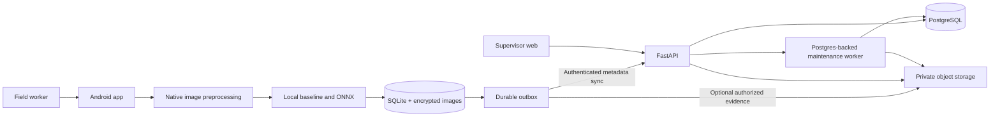

# System design

**Proposed architecture; no application implemented.** Requirements are authoritative in [requirements](../requirements.md). Decisions are conditional on the native-build and kit gates.

## Alternatives

| Criterion | A. Native local-first + modular server | B. PWA + browser inference | C. Configure mWater/ODK + capture companion |
|---|---|---|---|
| Durable field work / camera control | Strongest fit, but native build/storage work | Browser storage/eviction and camera differences need extra validation | Established collection; custom capture integration uncertain |
| Three-person delivery | Medium effort; aligned with previous stack | Fast UI start; mobile edge cases still costly | Lowest custom workflow effort if configuration fits |
| Local ML | ONNX native CPU; explicit image bridge | WASM/WebGPU compatibility/device tests | Depends on companion/API integration |
| Kit-specific UX | Full control | Full control within browser constraints | Constrained by host workflow |
| Operations | One API, DB, web, objects | Similar backend | Existing hosted service or own ODK |
| Decision | Recommend for stated full product | Not selected; not a lossless drop-in | Run configure-versus-build review before commercial commitment |

Architecture A preserves the chosen app vision. B is not an automatic fallback if native work fails: changing platforms needs a revised durability/device test plan. C may be commercially wiser, but access and workflow fit are unverified.

## Components and ownership

| Proposed path | Responsibility / owner | Why necessary |
|---|---|---|
| `apps/mobile/` | Expo/React Native TypeScript; A | Android source/protocol/capture/manual/queue screens |
| `modules/capture-native/` | Kotlin + OpenCV Android; B | Decode EXIF orientation, bounded image size, geometry/ROI/features off JS thread |
| `modules/secure-evidence/` | Platform crypto bridge; C | Encrypt local images and manage safe temporary files; SQLite encryption alone is insufficient |
| `apps/mobile/src/analysis/` | B, shared contract controlled by C | Deterministic baseline and bundled ONNX model, stable provenance/output |
| `services/api/` | FastAPI/Pydantic/SQLAlchemy/Alembic; C | Validation, tenant/role checks, authoritative transitions and sync |
| `apps/web/` | Next.js/TypeScript; A | Supervisor queue, review timeline and program summaries |
| `ml/` | Python, scikit-learn/PyTorch as needed; B | Reproducible feature/model training and evaluation, not online inference service |
| `contracts/` | Generated OpenAPI/client artifacts; C | One versioned boundary; no manually duplicated drifting types |
| `infra/` | Release config/runbooks; C | Reproducible deployment, backups and monitoring |
| `tests/` | Each owner plus independent reviewer | Cross-boundary and safety regression evidence |

Paths are proposed, not links to existing files. Do not create component-level instruction files unless actual ownership differences justify them.

## System structure



No cloud inference service. One codebase/server release owns domains: identity/catalog, samples, case workflow, evidence and reporting. Maintenance jobs run the same code in a separate process only when long scans/exports require it. No Redis/Kafka dependency.

## Capture pipeline

1. Online provisioning downloads assigned sources, protocols and the signed **model manifest** — metadata only. **Model weights ship inside the APK and are never downloaded at runtime in v1.** The manifest tells the device which bundled model version is approved for which protocol versions, and its SHA must match a bundled asset or the model is treated as unavailable (honest fallback, not silent substitution). Consequences: shipping new weights means shipping a new APK, while *disabling* an unsafe model takes effect on the next sync through manifest revocation. This asymmetry is intentional — revocation must be fast, promotion must be deliberate. An over-the-air weight channel is deferred until a measured need justifies its signing, storage and rollback burden.
2. Worker chooses source and kit. Protocol defines preparation/read times; a resumed app recomputes elapsed time. Reboot or uncertain clock invalidates analytical timing instead of guessing.
3. Camera captures a local file. Native module decodes with EXIF orientation, bounds working image size and identifies fiducials/manual corners. It preserves enough ROI resolution for the approved protocol.
4. Check missing reference, blur, clipped highlights, excessive glare, ambiguous strip ROI and out-of-window timing. Thresholds are experimentally fitted/versioned, not arbitrary safety values.
5. Normalize using approved reference patches; extract robust median features. Baseline gives a chart-bin suggestion. Eligible local model gives class logits/probabilities; abstain outside approved domain.
6. Show suggested result and uncertainty; user confirms or enters manual interpretation. Save both machine suggestion and human observation separately.
7. Encrypt image to temporary private file, flush/rename, then commit SQLite sample + asset reference + outbox atomically. Startup reconciles orphan files. A transaction cannot atomically commit a filesystem rename, so the recovery protocol is explicit.
8. Show local receipt only after durable success. Sync metadata independently of optional photo upload.

Image handling and ONNX run outside the UI thread where supported; no continuous inference over every preview frame. Camera and inference resources release on navigation.

## Synchronization lifecycle

```mermaid
sequenceDiagram
  participant U as Worker
  participant L as Local store
  participant A as API
  participant D as Database
  U->>L: Save confirmed screening
  L->>L: Commit sample + outbox
  L-->>U: Saved on this phone
  L->>A: POST /v1/sync/push with event UUID
  A->>D: Validate role, dedupe, insert immutable sample
  D->>D: Create review case if required; append tenant change
  D-->>A: Commit
  A-->>L: accepted + server references
  Note over A,L: If reply is lost, retry SAME event UUID
  L->>A: GET /v1/sync/pull?cursor=...
  A-->>L: Ordered changes + next cursor
  L->>L: Apply changes + cursor in one transaction
  L-->>U: Record synced; photo status separate
```

Exactly-once *business effect* is achieved through unique IDs/transactions under at-least-once delivery, not through a magical exactly-once network. Partial push success is acknowledged per event.

A per-tenant locked `sync_heads` row allocates change sequence numbers in the same commit as the mutation. All mutations lock this row first; keep transactions short. A bare global database sequence can be allocated before commit and make cursor clients miss a late-committing row; do not implement that shortcut.

The serial tenant lock is a deliberate pilot ceiling: replace with a proven commit-ordered changefeed only after hot-tenant throughput measurements justify it. Do not add CRDTs to case closure.

## Authority, caches and jobs

- Phone owns unsynced drafts; server owns accepted records and all collaborative case decisions.
- Source/protocol caches are versioned. Old records retain old versions; revoked protocols block new automated interpretations and flag pending records on reconnect.
- Server case state is never last-write-wins. Commands carry `expected_version`; conflicts require refreshed human review.
- Web query cache refreshes after mutation, on window focus and at a provisional 30-second active-board interval. Display fetched timestamp; no polling in hidden tabs.
- Device outbox is persistent, one active drain, bounded batch. Automatic backoff survives process restarts.
- Postgres jobs use row locking/leases, idempotent handlers and recorded status. Start with retention sweeps and bounded exports; no separate inference workers.
- Work queue fairness caps per-tenant batch work. Long uploads never hold database transactions.

## External boundaries

Identity via a standards-based OIDC provider selected in T06; mobile authorization-code flow with PKCE, web secure session cookie. Provider keys never enter client builds. Offline grants are separate from online access tokens; see [security](../engineering/security-and-privacy.md).

Lab reports are uploaded/entered by authorized people; no lab API is assumed. WQMIS external IDs/URLs are optional manual references until an approved integration exists. SMS/WhatsApp delivery is outside committed scope.

Official library support motivates this design, but the actual package matrix and native bridge must be proven on target hardware (D01–D09 in [register](../research/source-register.md)).

