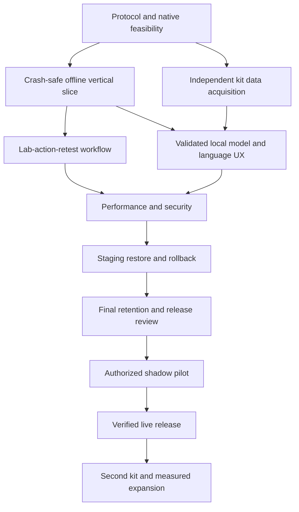

# Dependency-aware implementation plan

**Implementation authorized 22 September 2026.** Gate status and verified work are recorded in [current state](docs/agent-workflow/current-state.md).

Three teammates, A/B/C, own product, ML/native and backend/operations respectively. They may use Astra/Fable, but keep one human accountable per boundary. No claims about model capability or coding throughput are assumed.

## Dependency map

Milestones are capability gates, not permission to ignore cross-cutting work. Synthetic staging can precede final security review so restore/retention can be tested; real-data pilot cannot. Exact task dependencies in [to-do](to-do.md) override broad diagram ordering.

## M0 — De-risk measurement and build

**Goal/user outcome:** establish what can truthfully be demonstrated on actual hardware and selected kit.
**Requirements:** REQ-002/003/009/026/028.
**Entry:** user authorizes implementation; kit/hardware questions can remain explicit blockers.
**Tasks/deliverables:** T01–T04; protocol/eligibility note, prior-art user validation, pinned native-build matrix, file-to-feature proof.
**Acceptance/verification:** G0; APK offline tensor + camera fixture; domain review of timing/units. Evidence: device/build logs, golden outputs and signed protocol decision.
**Risks:** event eligibility, missing kit, native dependency mismatch.
**Effort:** 6–12 person-hours initial investigation; external access can take days. If bridge fails, report options before changing platforms or removing local AI.

## M1 — Complete durable field slice

**Goal:** a worker records a real or clearly synthetic test offline, restarts the phone app, reconnects and sees the same accepted record.
**Requirements:** REQ-001–REQ-004/006–REQ-009/017/023/027.
**Entry:** native/protocol feasibility and frozen v1 schema.
**Tasks/deliverables:** T05–T15 plus T45; source/protocol/capture/manual review, local receipt, immutable ingestion, ordered pull and auth/offline access.
**Acceptance/verification:** AC-001–AC-004/006–AC-009/017 applicable paths; G1. Process-kill and lost-response replay are mandatory; exact commands become known in T03/T05.
**Evidence:** synthetic recording, local/server counts and hashes, error receipts; no “AI validated” claim.
**Risks:** interrupted writes, protocol timing, bootstrap cursor gaps, role revocation.
**Effort:** 24–40 person-hours with integration uncertainty. Independent mobile/backend work only after contract freeze.

## M2 — Complete evidence-to-action loop

**Goal:** supervisor can refer, verify, record action, retest, communicate and close with visible proof.
**Requirements:** REQ-010–REQ-015/018/023.
**Entry:** accepted immutable samples and membership/command contracts.
**Tasks/deliverables:** T16–T22, T43, T46; private evidence boundary, state engine, board, report verification, actions, guarded closure, safe summaries/exports.
**Acceptance/verification:** G2, including failed incomplete closure, wrong-source report and reviewer race.
**Evidence:** full case history plus negative test logs and domain-approved closure policy; mock reports clearly synthetic.
**Risks:** building a pretty board without meaningful state guards; treating upload as verified lab evidence.
**Effort:** 20–36 person-hours plus reviewer availability. T46 may initially block operational use while synthetic demo proceeds.

## M3 — Validated local intelligence and field usability

**Goal:** eligible supported captures receive locally computed assistance with justified uncertainty; users can complete the flow in reviewed languages.
**Requirements:** REQ-005/016/019.
**Entry:** data protocol and feature bridge; independent labeled preparations, not generated images.
**Tasks/deliverables:** T23–T28, T44; manifest/splits, baseline comparison, deployable model, calibration/domain report, accessible language flows.
**Acceptance/verification:** G3; quality/coverage gates from evaluation, airplane-mode parity, TalkBack/keyboard and comprehension checks.
**Evidence:** model/data hashes, independent-unit counts, confusion/calibration plots, raw device results.
**Risks:** label access, leakage, kit/phone shift, weak statistical precision.
**Effort:** 18–36 person-hours engineering plus physical acquisition/lab time over days/weeks. No promise to finish valid science inside30hours.

## M4 — Performance and security under failure

**Goal:** full implemented functions remain correct under slow networks, concurrency, hostile inputs and resource pressure.
**Requirements:** REQ-017/018/020/021/025/027.
**Entry:** integrated workflow and candidate model; synthetic data may be used for infrastructure stress, not analytical accuracy.
**Tasks/deliverables:** T29–T34, T45, T47, T48; benchmark reports, encrypted storage, safe telemetry, end-to-end regression, final boundary review.
**Acceptance/verification:** G4; no unresolved high-severity safety/tenant/data-loss issue. T47/T48 follow staging restore work in M5 before any real pilot.
**Evidence:** raw timing distributions, resource/error counts, independent security/a11y results.
**Risks:** overselling tails from tiny samples; hiding quality loss through abstention.
**Effort:** 16–30 person-hours plus repeated benchmark runs; defects add rework rather than relaxed gates.

## M5 — Operated, deployed and verified pilot

**Goal:** authorized operator can use a recoverable service; team can show useful workflow evidence and an honest demo.
**Requirements:** REQ-022/025/026 plus prior gates.
**Entry:** budget/data authorization; synthetic staging first. Real-data pilot requires T48 and approved domain/privacy protocol.
**Tasks/deliverables:** T35–T39; staging, backup restore, rollback, field/buyer learning, live verification; complete T47/T48 before T38.
**Acceptance/verification:** G5; live synthetic smoke plus approved field protocol, recovery measurements and owner handoff.
**Evidence:** actual environment/build, restore/rollback trace, baseline/pilot denominators and operator approval.
**Risks:** event deadline, absent lab capacity, privacy policy, operator non-adoption.
**Effort:** 10–22 person-hours deployment/analysis plus weeks of pilot observation. A pilot may reveal a need to revise positioning.

## M6 — Full initial product and bounded expansion

**Goal:** complete initial required scope, including repeatable kit onboarding and credible capacity boundaries.
**Requirements:** REQ-024/028 and final traceability of all28.
**Entry:** approved first-kit pilot and verified release.
**Tasks/deliverables:** T40–T42; second-kit validation,10× dataset test, independent release evidence index/fresh-agent handoff.
**Acceptance/verification:** G6; every AC has actual evidence; unsupported claims absent.
**Evidence:** second-kit report, scale traces, complete release/handoff index.
**Risks:** assuming first-kit accuracy transfers; uncontrolled configuration.
**Effort:** 8–18 person-hours engineering plus new data and partner validation.

Aggregate engineering range is roughly100–194 person-hours before contingency, with some task overlap between gates. Plan **120–240 person-hours including integration/rework**, not a guaranteed estimate. External chemistry, procurement and pilot work can dominate elapsed calendar time.

## 30-hour event allocation — a demonstration checkpoint

3×30=90 nominal person-hours, but assume roughly54–66 focused person-hours after rest, integration, judging and coordination. This cannot complete the full validated production roadmap.

| Event time | A | B | C | Checkpoint |
|---|---|---|---|---|
| 0–3h | Scope/protocol/screens | Native build/pixel proof | Contract/auth/data skeleton | G0 attempt; synthetic boundary if kit not ready |
| 3–10h | Source/protocol/manual flow | Quality baseline/local model spike if lawful data available | Immutable ingestion/case skeleton | One local record survives restart |
| 10–18h | Queue and supervisor path | Device parity/uncertainty tests | Sync and guarded transitions | Same record on phone and server |
| 18–24h | Full demo loop/copy | Failure-case/latency evidence | Lab/action/retest synthetic scenario | Reject incomplete closure; replay safe |
| 24–27h | Polish accessibility/labels | Verify actual inference behavior | Fix only blocking integration defects | Freeze working build |
| 27–30h | Rehearse/pitch | Backup APK/screens/video | Release evidence/backup demo server | Two cold rehearsals; transparent disclosures |

Pre-event work depends on organizer rules; this schedule does not authorize prebuilding prohibited code. If local ML has no adequate data, show a clearly experimental model or pending module, and explain validation work; do not relabel deterministic rules as AI. Full REQ-005 remains scheduled.

## First actionable tasks after authorization

A: T01, then T02. B: T03, then T04 once protocol is defined. C: T05 with synthetic schemas, then T06. Do not run three agents against the same dependency/schema files. Checkpoint after the first native-camera proof before spending hours on polished UI.

Stop and record an architectural decision if the selected kit cannot produce a reproducible reference, the actual phone cannot run the native stack, or official rules conflict with the preparation plan.

